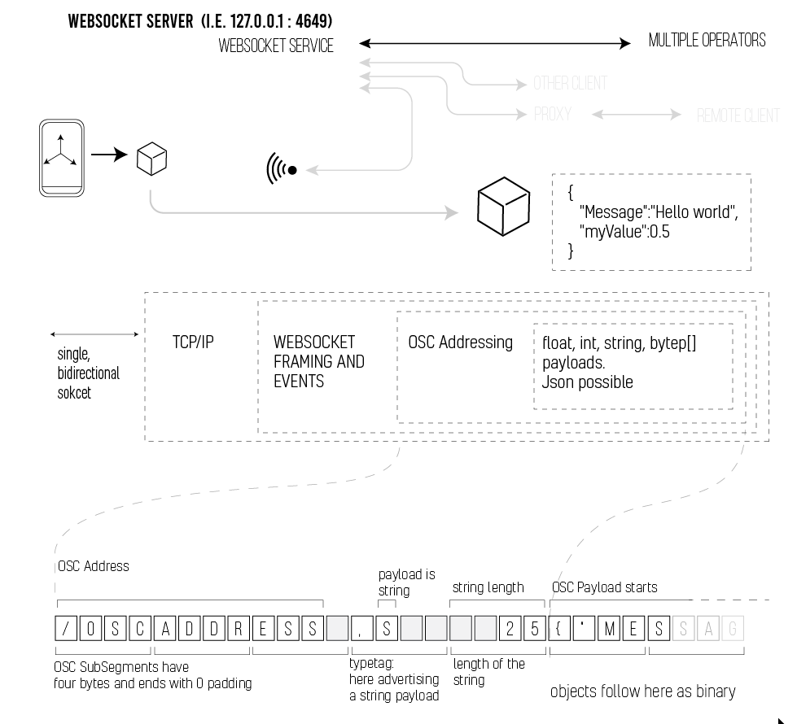
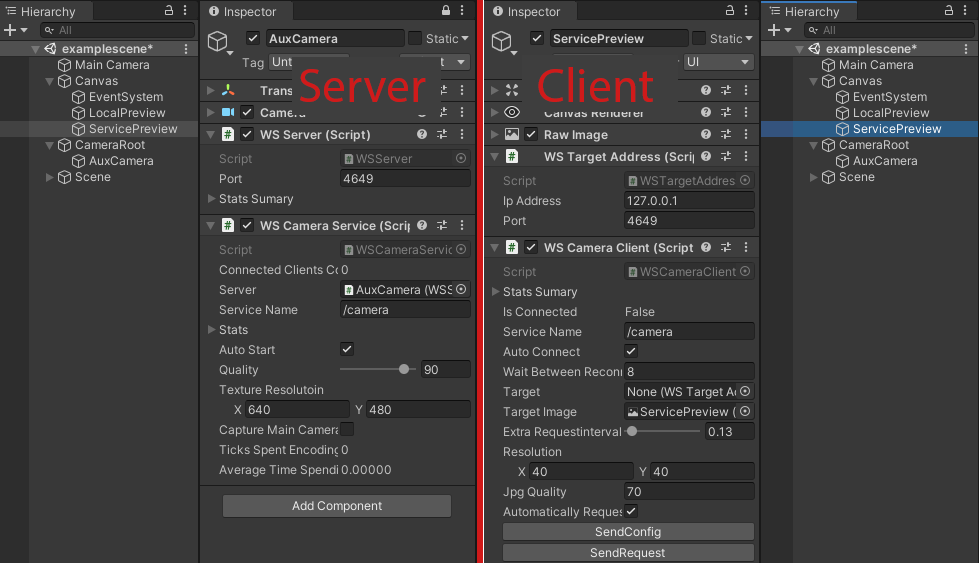

## WS and OSC Framework Snapshot

### Purpose

The purpose of this project is to provide a framework for  controlling Unity3D Scenes using a terminal attached through the network. This is not a multi player gaming solution, it has to do more with controling realtime VJ grapics (in a collaborative yet distributed way) than with games

This repo wraps around a minimal version (subrepo) to demonstrate the general idea behing the concept. Do not rely on stuff published here to be clean, initial commits are meant to 'harden' a working template - its going to be a bigger thing probably, but so far working snapshots are important.

Treat it as a a proof of concept snapshot of an idea

### Credits

Bulk of the code here comes from WebsocketSharp

https://github.com/sta/websocket-sharp

It has been adjusted here and there to glue a bit better with Unity3D (original examples were more of a VisualStudio c# flavor)

OSC part is based on UnityOSC  Copyright (c) 2012 Jorge Garcia Martin, which I keep modding (replacing it bit by bit, my mod called zOSC has its own repo)

### Why not use OSC

That is a very good question. OSC is a very good choice for most things. There is however a few issues 

- No connection state - the UDP datagrams might go somewhere ... or not
- Requires managing a pair of ports (send and recieve ports)
- Traffic sometimes gets filtered out by routers
- Can't do further than local network without some fuss

On the other hand WebSockets were designed to be transparent to the routers - from a switch point of view its just you making a web request. The connection is bidirectinal and supports message arrival events (so no pooling necessary). You also get nice callbacks when your connection changes state, and can basically detect a connection, which is great compared to pure OSC.

OSC is not great if you want to transfer larger, more complex structures, it was designed more for floats and short strings, but it has an advantage of being super fast (basic microprocessor friendly). Everything is aliogned to 32bit word boundary, and a parser can be written in few pages. 

## Combo approach

What I've done here is combined websockets (as a transport medium and service logic) with speed and immediacy of OSC messages.

## Getting started:

Working with this toolkit consits of certain steps. First thing to understand is that server (the one that exposes a service) and client (that only uses a service) are very different beasts in WebSocket.

The most important part is - WSServer. The only input it takes is port number to start the service on. It hosts Service providers, which registar ip:port/url address, so that client looking for /foo will get to talk with a diffferent handler than a client addressing /bar. You can add any number of components inheriting from WSServiceBase to provide servies.

For a client - in the current setup you'll need an instance of WSTargetAddress somewhere, so that all the different clients can locate the same server. This was done to avoid the situation where half of your scene tries to connect to one endpoint, and another looks somewhere else. If this is waht you want, use more WSTargetAddresses

    public class WSTargetAddress : MonoBehaviour {

        public string ipAddress = "127.0.0.1";
        public int port = 4649;
    }

To write your client, extend WSOSCClient, overriding

    protected override void OnOSCMessage(OSCMessage message)
    {
       
        if (message.Address == WSCameraService.oscFrameAddress)
        {
            int x= message.GetInt(0);
            int y= message.GetInt(1);
            byte[] data = message.GetBytes(2);
            // do something
        }
    }

The Service part underneath has a slightly different callback - for the server

	protected override void OnMessageDequeue(WSServiceBehaviour beh, MessageEventArgs message)
	{
		Debug.Log("pointcloud serverrecieved " + message.RawData.Length);
	}

and for the client (client has only one connection)
       
       protected override void OnMessageDequeue(MessageEventArgs message)
        {
            Debug.Log("  recieved " + message.Data.Length + " bytes);
        }

There is an OSC wrapper on top but in case you only want websockets you can very much use them.

There is an extra parameter, WSServiceBehaviour, which can be used to identify individual clients

## Writing your stuff

If your server has a WSServer instance, asd your client (thich can be two components on the same scene or on terminals miles apart) points to it and is able to reach it, its time to write some network code.

Exentd from WSOSCClient or WSOSCServer.
Server uses a WSServiceBehaviour handler object, which inherits from WebSocketBehavior, the only thing added is some queues to synchronize threads between unity and network.

Also I had to change opcode to .text in websockets, otheriwse binary content didn't go through.

An example scene - an aux camera renders to a rendertexture where a component blits it to a tiny thumbnail, compresses it with JPG and sends as OSC blob payload to the client, when requested.

s
## Gotchas

I suspect this is a problem with WebsocketSharp but I had trouble sending binary content, so I tweaked the library a bit. I am not sure why it didn't work so I didn't want to hide the cause, but the call to use for binary sends is SendAsync(byte[] payload, null) - the async callback seems to work (if changed to opcode.text).
The UnityOSC Syntax for adding payload is

        OSCMessage message = new OSCMessage("/address");
		message.Append(x);

Than to send such frame correcly wrapped in a Websocket frame we need to use:

beh.SendAsync(message.BinaryData, null);

This is likely to change at some point.

    public void SendFrame(WSServiceBehaviour beh)
	{
		System.Diagnostics.Stopwatch stopwatch = new System.Diagnostics.Stopwatch();
		stopwatch.Start();
		if (captureMainCamera)
			rt = camera.targetTexture;

		if (!rt.CheckDimensions(textureResolutoin))
		{
			rt = new RenderTexture(textureResolutoin.x, textureResolutoin.y, 8);
			rt.name = textureResolutoin.ToString();
		}
		//	var oldRT = RenderTexture.active;
		camera.Render();
		Graphics.Blit(camera.targetTexture, rt);
		RenderTexture.active = rt;
		if (!texture.CheckDimensions(rt))
		{
			texture = new Texture2D(rt.width, rt.height);
			texture.name = textureResolutoin.ToString();
		}
		texture.ReadPixels(new Rect(0, 0, rt.width, rt.height), 0, 0);
		texture.Apply();

		byte[] bytes = texture.EncodeToJPG(quality);

		OSCMessage message = new OSCMessage(oscFrameAddress);
		message.Append(bytes);
		beh.SendAsync(message.BinaryData, null);
    }

## ToDo:
OSC parser and writer rewrite is in progress - this should become seriously fast at some point.

